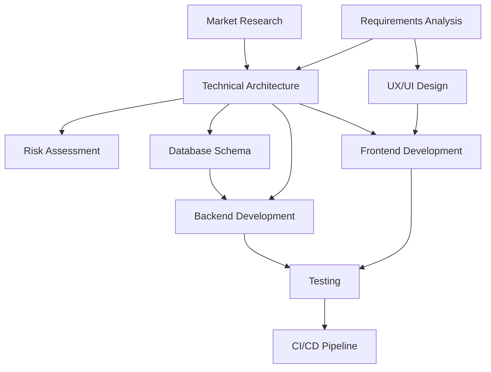

# Multi-Agent SaaS Development System

A comprehensive system of 32+ specialized AI agents for automated SaaS application development, from requirements analysis to maintenance and growth.

## 🏗️ System Architecture

### Agent Categories

#### 📋 Planning & Strategy Agents (4)
- **Requirements Analysis Agent** - Conducts stakeholder interviews, creates user stories, defines acceptance criteria
- **Market Research Agent** - Analyzes competitors, validates pricing models, identifies feature gaps  
- **Technical Architecture Agent** - Designs system architecture, selects tech stack, plans scalability
- **Risk Assessment Agent** - Identifies technical and business risks, creates mitigation strategies

#### 🎨 Design & Prototyping Agents (4)
- **UX/UI Design Agent** - Creates wireframes, prototypes, user journey maps, design systems
- **Database Schema Agent** - Designs optimal database structure, handles migrations, optimizes queries
- **API Design Agent** - Creates RESTful/GraphQL specifications, handles versioning, documents endpoints
- **Security Architecture Agent** - Implements authentication, authorization, data encryption, compliance

#### 💻 Development Agents (4)
- **Frontend Development Agent** - Builds React/Vue components, handles state management, responsive design
- **Backend Development Agent** - Creates server logic, API endpoints, business logic implementation
- **Database Agent** - Handles all database operations, migrations, backups, optimization
- **Authentication Agent** - Manages user registration, login, password reset, session management

#### 🧪 Quality Assurance Agents (4)
- **Testing Agent** - Writes unit tests, integration tests, end-to-end tests, maintains test coverage
- **Code Review Agent** - Reviews code quality, enforces standards, suggests improvements
- **Performance Testing Agent** - Monitors app speed, conducts load testing, optimizes bottlenecks
- **Security Testing Agent** - Performs vulnerability scans, penetration testing, security audits

#### 🚀 DevOps & Infrastructure Agents (4)
- **CI/CD Pipeline Agent** - Manages automated builds, testing, deployment workflows
- **Infrastructure Agent** - Handles cloud provisioning, scaling, monitoring, cost optimization
- **Monitoring Agent** - Sets up logging, alerting, performance tracking, error reporting
- **Backup & Recovery Agent** - Manages data backups, disaster recovery, system restoration

#### 📊 Business Operations Agents (4)
- **Documentation Agent** - Creates technical docs, user guides, API documentation, maintains wikis
- **Analytics Agent** - Tracks user behavior, conversion metrics, feature usage, business KPIs
- **Customer Support Agent** - Handles user inquiries, creates help content, manages feedback
- **Marketing Automation Agent** - Manages email campaigns, user onboarding flows, retention strategies

#### 💰 SaaS-Specific Agents (4)
- **Subscription Management Agent** - Handles billing, invoicing, plan upgrades/downgrades, payment processing
- **Multi-tenancy Agent** - Manages tenant isolation, data segregation, feature flags per plan
- **Onboarding Agent** - Creates user onboarding flows, tutorials, feature discovery
- **Usage Tracking Agent** - Monitors feature usage, billing metrics, quota enforcement

#### 🔧 Maintenance & Growth Agents (4)
- **Bug Tracking Agent** - Logs issues, prioritizes fixes, tracks resolution progress
- **Feature Request Agent** - Collects user feedback, prioritizes new features, manages roadmap
- **A/B Testing Agent** - Runs experiments, analyzes results, implements winning variants
- **Performance Optimization Agent** - Continuously monitors and improves app performance

## 🚀 Quick Start

### Basic Usage

```javascript
const AgentOrchestrator = require('./agents/agent-orchestrator');

// Initialize the orchestrator
const orchestrator = new AgentOrchestrator({
  projectName: 'My SaaS Project',
  projectType: 'saas-platform',
  developmentMode: 'agile'
});

// Run a complete development cycle
const results = await orchestrator.runFullDevelopmentCycle({
  projectRequirements: {
    targetUsers: 1000,
    features: ['user-management', 'billing', 'analytics'],
    timeline: '6-months'
  }
});

console.log('Development cycle completed:', results.summary);
```

### Execute Specific Workflows

```javascript
// Run just the planning phase
const planningResults = await orchestrator.executeWorkflow('Planning Phase', {
  stakeholders: ['admin', 'staff', 'customer'],
  businessGoals: ['increase-efficiency', 'reduce-costs']
});

// Run design phase
const designResults = await orchestrator.executeWorkflow('Design Phase', {
  userStories: planningResults.results.RequirementsAnalysisAgent.userStories
});
```

### Manual Agent Execution

```javascript
// Execute individual agents
const requirementsAgent = orchestrator.agents.get('RequirementsAnalysisAgent');
const analysis = await requirementsAgent.analyzeRequirements(stakeholderInput);

const architectureAgent = orchestrator.agents.get('TechnicalArchitectureAgent');
const architecture = await architectureAgent.designArchitecture(analysis);
```

## 📁 Directory Structure

```
agents/
├── agent-orchestrator.js          # Main orchestrator
├── planning-strategy/
│   ├── requirements-analysis-agent.js
│   ├── market-research-agent.js
│   ├── technical-architecture-agent.js
│   └── risk-assessment-agent.js
├── design-prototyping/
│   ├── ux-ui-design-agent.js
│   ├── database-schema-agent.js
│   ├── api-design-agent.js
│   └── security-architecture-agent.js
├── development/
│   ├── frontend-development-agent.js
│   ├── backend-development-agent.js
│   ├── database-agent.js
│   └── authentication-agent.js
├── quality-assurance/
│   ├── testing-agent.js
│   ├── code-review-agent.js
│   ├── performance-testing-agent.js
│   └── security-testing-agent.js
├── devops-infrastructure/
│   ├── cicd-pipeline-agent.js
│   ├── infrastructure-agent.js
│   ├── monitoring-agent.js
│   └── backup-recovery-agent.js
├── business-operations/
│   ├── documentation-agent.js
│   ├── analytics-agent.js
│   ├── customer-support-agent.js
│   └── marketing-automation-agent.js
├── saas-specific/
│   ├── subscription-management-agent.js
│   ├── multi-tenancy-agent.js
│   ├── onboarding-agent.js
│   └── usage-tracking-agent.js
└── maintenance-growth/
    ├── bug-tracking-agent.js
    ├── feature-request-agent.js
    ├── ab-testing-agent.js
    └── performance-optimization-agent.js
```

## 🔄 Workflow Execution

### Development Phase Flow

1. **Planning Phase** (Parallel + Sequential)
   - Parallel: Requirements Analysis + Market Research
   - Sequential: Technical Architecture → Risk Assessment

2. **Design Phase** (Parallel + Sequential)  
   - Parallel: UX/UI Design + Database Schema + API Design
   - Sequential: Security Architecture

3. **Development Phase** (Parallel + Sequential)
   - Parallel: Frontend + Backend Development
   - Sequential: Database → Authentication

4. **QA Phase** (Parallel + Sequential)
   - Parallel: Testing + Code Review  
   - Sequential: Performance Testing → Security Testing

5. **Deployment Phase** (Sequential)
   - CI/CD Pipeline → Infrastructure → Monitoring → Backup

6. **Operations Phase** (Parallel)
   - Documentation + Analytics + Support + Marketing

7. **SaaS Phase** (Mixed)
   - Parallel: Subscription + Multi-tenancy
   - Sequential: Onboarding → Usage Tracking

8. **Maintenance Phase** (Parallel)
   - Bug Tracking + Feature Requests + A/B Testing + Performance Optimization

### Agent Dependencies



## ⚙️ Configuration

### Agent Configuration

```javascript
const orchestrator = new AgentOrchestrator({
  projectName: 'Hostclub Guide SaaS',
  projectType: 'saas-platform',
  developmentMode: 'agile',
  
  // Global agent configurations
  agentDefaults: {
    timeout: 30000,
    retries: 3,
    logging: true
  },
  
  // Specific agent overrides
  agentConfig: {
    RequirementsAnalysisAgent: {
      stakeholderTypes: ['admin', 'staff', 'customer'],
      priorityLevels: ['high', 'medium', 'low']
    },
    SubscriptionManagementAgent: {
      currency: 'JPY',
      billingCycles: ['monthly', 'annual'],
      paymentMethods: ['credit_card', 'bank_transfer']
    }
  }
});
```

### Workflow Customization

```javascript
// Add custom workflow
orchestrator.workflows.push({
  name: 'MVP Development',
  phase: 'mvp',
  agents: [
    'RequirementsAnalysisAgent',
    'UXUIDesignAgent', 
    'FrontendDevelopmentAgent',
    'TestingAgent'
  ],
  parallel: ['RequirementsAnalysisAgent', 'UXUIDesignAgent'],
  sequential: ['FrontendDevelopmentAgent', 'TestingAgent']
});
```

## 🛠️ Manual Setup Tasks

### 1. Implement Missing Agent Classes

Currently some agents are placeholders. Implement based on your needs:

```javascript
// Example: Implement a missing agent
class DatabaseSchemaAgent {
  constructor(config = {}) {
    this.name = 'Database Schema Agent';
    this.config = config;
  }

  async designSchema(requirements) {
    // Your implementation here
    return {
      tables: [],
      relationships: [],
      indexes: [],
      migrations: []
    };
  }
}
```

### 2. Configure External Integrations

Set up integrations for:
- Payment processors (Stripe, PayPal, Japanese payment methods)
- Cloud providers (AWS, GCP, Azure)
- Monitoring services (DataDog, New Relic)
- Communication services (SendGrid, Twilio)

### 3. Environment Setup

```bash
# Install dependencies
npm install

# Set environment variables
cp .env.example .env

# Configure database
npm run db:setup

# Run development server
npm run dev
```

### 4. Customize for Your Project

- Update agent configurations for your specific requirements
- Modify workflows based on your development process
- Add project-specific validation rules
- Configure monitoring and alerting

## 📊 Monitoring & Reporting

### System Status

```javascript
// Get current system status
const status = orchestrator.getSystemStatus();
console.log(`Active agents: ${status.orchestrator.totalAgents}`);
console.log(`Current phase: ${status.orchestrator.currentPhase}`);
```

### Generate Reports

```javascript
// Generate comprehensive system report
const report = orchestrator.generateReport();

// Includes:
// - Agent implementation status
// - Workflow summaries  
// - Performance metrics
// - Recommendations
```

## 🎯 Use Cases

### 1. New SaaS Project
Start with planning phase and run through complete development cycle

### 2. Existing Project Enhancement
Run specific workflows like "SaaS Implementation Phase" or "Performance Optimization"

### 3. Project Analysis
Use planning agents to analyze and improve existing systems

### 4. Team Coordination
Use orchestrator to coordinate different development teams and ensure dependencies are met

## 🔧 Extensibility

### Adding New Agents

1. Create agent class following the established pattern
2. Register with orchestrator
3. Define dependencies
4. Add to appropriate workflow

### Custom Workflows

Create domain-specific workflows for your needs:
- E-commerce specific flows
- Mobile app development
- API-first development
- Microservices migration

## 📝 Contributing

1. Implement placeholder agents
2. Add test coverage for agent interactions  
3. Improve error handling and recovery
4. Add integration with external tools
5. Enhance reporting and monitoring

## ⚠️ Current Limitations

- Some agents are placeholders and need implementation
- Limited error recovery mechanisms  
- No persistent state management
- Basic dependency resolution
- Minimal integration testing

## 🚀 Roadmap

- [ ] Implement all placeholder agents
- [ ] Add persistent state management
- [ ] Enhance error handling and recovery
- [ ] Add integration with external project management tools
- [ ] Implement agent performance monitoring
- [ ] Add support for distributed agent execution
- [ ] Create web UI for orchestrator management
- [ ] Add support for different programming languages/frameworks

---

This multi-agent system provides a comprehensive framework for SaaS development. Start with the implemented agents and gradually extend the system based on your specific needs.